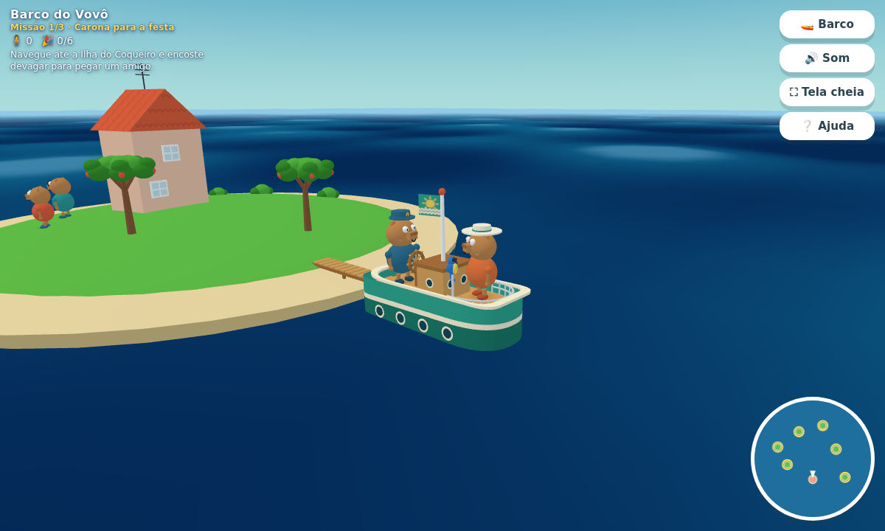
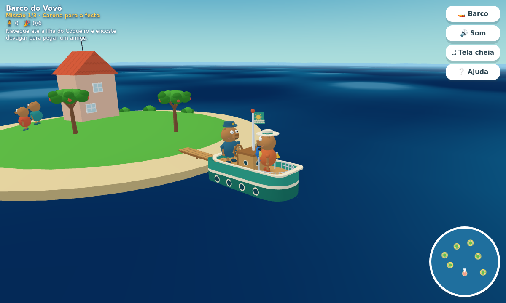
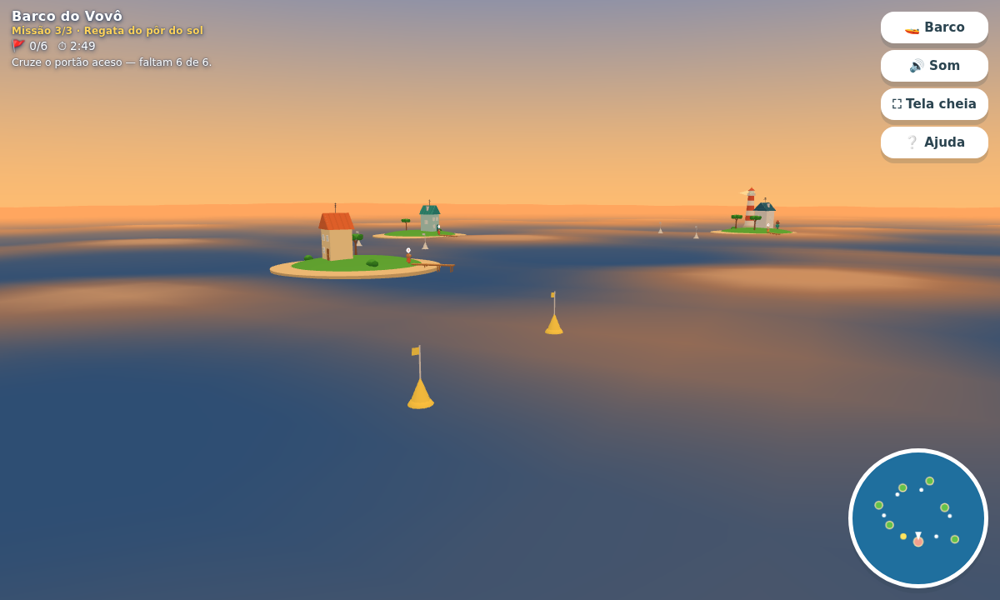
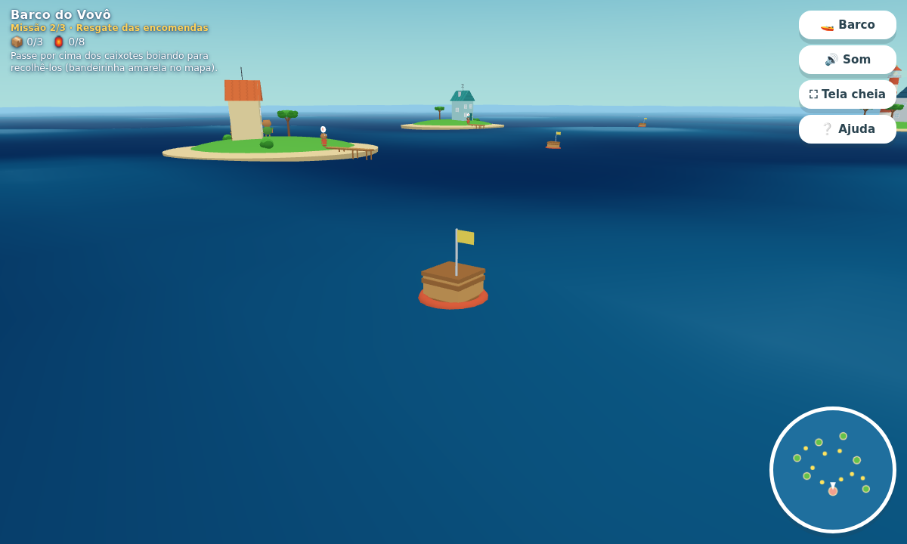
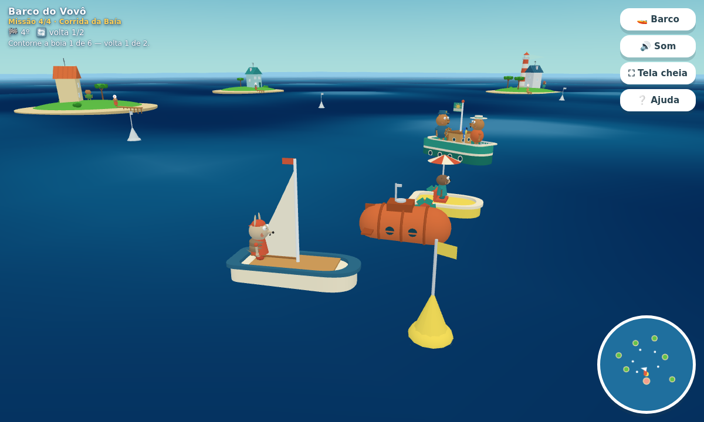

# Barco do Vovô 🚤

Jogo em [three.js](https://threejs.org/) num arquipélago tropical: o mar de turquesa da
**Baía Dourada**, ilhas de areia clara com casinhas coloridas e o barco verde-mar do
**Vovô Tonico**, uma capivara de quepe de capitão. São quatro missões seguidas, e tudo é
modelado com geometria simples e cores chapadas — não há nenhuma imagem ou modelo 3D
externo no projeto.



| O arquipélago inteiro | A regata do pôr do sol |
| --- | --- |
|  |  |

## Jogar online

**[ricardopera.github.io/grandpa_boat](https://ricardopera.github.io/grandpa_boat/)**

O site é publicado pelo workflow `.github/workflows/pages.yml` a cada push: o
repositório inteiro é o site, porque o jogo é estático e não precisa de build.
Para isso funcionar, o repositório precisa ser público e o GitHub Pages precisa
estar com a origem **GitHub Actions** (Settings → Pages → Source).

## Rodar localmente

```bash
npm start          # abre em http://localhost:5173
```

Qualquer servidor estático serve — o jogo é HTML + módulos ES puros. Não dá para abrir
o `index.html` direto pelo `file://` porque o navegador bloqueia módulos ES nesse
protocolo; por isso o `npm start` sobe um servidor mínimo (`server.mjs`, sem dependências).

## As quatro missões

O painel do canto esquerdo mostra sempre em que missão você está, os contadores dela e o
que fazer agora. O minimapa marca o alvo da vez.

### 1. Carona para a festa 🎈

Seis amigos esperam carona, um em cada ilha (marcadas com um círculo amarelo no mapa e
com um balãozinho de exclamação sobre a cabeça). Encoste devagar em cada ilha para eles
embarcarem e leve todos até a **Ilha da Enseada**, a ilha rosada do mapa, onde vai
acontecer a festa. Quem chega fica acenando no gramado — a festa cresce a cada viagem.

### 2. Resgate das encomendas 📦



A ventania espalhou pelo mar os oito caixotes de mantimentos do farol. Passe por cima
deles para recolher — cabem **três por vez** no convés, e os caixotes recolhidos ficam
empilhados atrás da cabine. Descarregue na **Ilha do Farol**; a pilha na praia vai
crescendo até o último caixote chegar.

### 3. Regata do pôr do sol 🌅

O sol começa a se pôr e o céu, o mar e a luz das ilhas viram dourados. Dê a volta no
arquipélago cruzando os **seis portões de boias na ordem** — a dupla de boias acesa em
amarelo é sempre a próxima — antes que o relógio zere. Se o tempo acabar, a regata
recomeça do primeiro portão.

### 4. Corrida da Baía 🏁



Três barcos desafiam o Vovô Tonico num circuito de seis boias, **duas voltas**:

- **Vento Sul**, um veleiro — o mais rápido nas retas;
- **Sardinha**, um submarino de estaleiro que **mergulha e volta à tona** no meio do
  caminho, soltando bolhas;
- **Pé-de-Pato**, um pedalinho de rodas de pás e guarda-sol — lento, mas nunca erra a curva.

Cada um segue as boias com o seu próprio jeito de acelerar e curvar, então as posições
trocam durante a prova. Encostar num adversário empurra os dois e tira velocidade. O
painel mostra a colocação e a volta; terminar já fecha a missão, mas a graça é chegar em
primeiro.

## Controles

| Tecla | Ação |
| --- | --- |
| `W` / `↑` | acelera |
| `S` / `↓` | ré |
| `A` `D` / `←` `→` | leme |
| `C` | alterna entre pilotar o barco e a câmera livre |
| `H` | toca o sino do barco |
| `R` | recoloca a câmera atrás do barco |

O texto da missão fica direto sobre a cena, sem caixa, para ocupar o mínimo da tela.

O botão `⛶ Tela cheia` usa a API de fullscreen, que **não funciona dentro dos
navegadores embutidos de aplicativos** (o do Google, o do WhatsApp, as Custom Tabs
do Chrome) — nesses casos o jogo avisa na tela. Para tela cheia de verdade no
Android, use "Adicionar à tela inicial": o `manifest.webmanifest` declara
`display: fullscreen`, então o atalho abre sem nenhuma barra do navegador.

O mouse gira a vista (arrastar) e aproxima (rolagem) nos dois modos. No modo câmera
livre, `WASD` desliza a vista sobre o mar.

No celular aparece um analógico no canto inferior esquerdo: arraste a manopla na
direção do movimento. Ele é proporcional — perto do centro o barco anda devagar e
faz curvas abertas, no limite da borda vai a toda. Serve aos dois modos: pilota o
barco ou desliza a câmera.

## Os dois modos

- **Barco** — a câmera segue o barco e volta sozinha para trás dele conforme você navega,
  respeitando a altura e a distância que você escolheu.
- **Câmera** — o barco fica parado e você sobrevoa o arquipélago livremente, para ver
  todas as ilhas de uma vez.

## Estrutura

```
index.html          página e HUD
styles.css          interface (painel, mapa, botões, telas de início, missão e vitória)
server.mjs          servidor estático mínimo para desenvolvimento
src/
  main.js           inicialização, laço de animação e teclas globais
  game.js           o arquipélago, os moradores e o encadeamento das missões
  missions.js       as quatro missões (carona, encomendas, regata e corrida)
  rivals.js         os barcos adversários da corrida e a navegação deles
  world.js          mar, céu, sol, nuvens, gaivotas, luzes e a virada para o fim de tarde
  island.js         monta cada ilha (calota de grama, praia, casa, quintal, cais, farol)
  house.js          casas de duas águas com telhas, janelas, antena e trepadeira
  props.js          árvores, arbustos, balanço, cais, farol, caixotes e boias de regata
  character.js      capivaras, lontras e tatus, e suas animações
  boat.js           o barco, a tripulação, a espuma e a física da navegação
  controls.js       entrada de teclado/toque e as duas câmeras
  hud.js            painel de missão, mensagens e minimapa
  joystick.js       analógico de toque (arrasto proporcional)
  audio.js          efeitos sonoros sintetizados no navegador
  materials.js      materiais chapados reaproveitados e formas utilitárias
  textures.js       texturas geradas em canvas (telhas, bandeira do barco)
  palette.js        as cores da Baía Dourada
test/
  playthrough.mjs   regressão: joga as quatro missões e confere contadores e encaixes
vendor/             three.js r185 e OrbitControls (cópia local, jogo roda offline)
```

## Testar

```bash
npm start                    # num terminal
npm i playwright && npm test # noutro
```

O teste abre o jogo num Chromium, teleporta o barco pelos alvos das quatro missões e
confere os contadores, as telas de fim de missão, a vitória, a virada do pôr do sol, a
colocação na corrida e o recomeço — além de falhar se aparecer qualquer erro de console.

Ele também mede duas coisas que foto não resolve: se a bandeira está mesmo encostada no
mastro (um pano em movimento *parece* encostado em certas fases do balanço) e se os
adversários da corrida navegam sozinhos, em velocidade medida no tempo simulado do jogo
— tempo de parede não serve, porque em navegador headless o laço roda a poucos quadros.

## Detalhes de implementação

- **Mar** — um plano com deslocamento de vértices num `ShaderMaterial`. A mesma fórmula
  de onda existe em JavaScript (`waveHeight`), então o barco, os caixotes e as boias de
  regata boiam exatamente na altura certa da onda. O mar, o céu e o sol acompanham a
  câmera: o mundo nunca tem fim à vista.
- **Pôr do sol** — `applyDaylight(t)` mistura duas paletas (dia e fim de tarde) em tudo o
  que dá cor à cena: fundo, névoa, céu, mar, disco do sol e as três luzes. A terceira
  missão só empurra `t` de 0 a 1 devagar. Como céu e mar são `ShaderMaterial` — que
  escrevem direto no framebuffer, sem a conversão de espaço de cor dos outros materiais —
  as cores deles na paleta já vêm compensadas para cair no tom certo na tela.
- **Casco** — construído anel por anel em vez de extrudado, para as faixas de cor
  (verde-mar, listra creme e verde escuro) saírem retas e nítidas.
- **Praia** — cada ilha é uma calota de grama com uma rampa de areia em volta. A rampa é
  inclinada de propósito: um anel plano na linha d'água brigaria pixel a pixel com a onda.
- **Estilo chapado** — luz ambiente forte com um pouco de direcional, materiais Lambert
  e nenhuma textura fotográfica; as únicas texturas são desenhadas em `<canvas>`.
- **Sem build** — nada de bundler ou instalação: os módulos ES são carregados direto pelo
  navegador via `importmap`, e o three.js está versionado em `vendor/`.

## Origem

O jogo nasceu do protótipo [Pepas-Island](https://github.com/ricardopera/Pepas-Island), do
mesmo autor, e seguiu daqui com identidade própria: outro elenco (capivaras, lontras e
tatus), outra paleta, outro barco, farol, praias e as três missões encadeadas descritas
acima. Personagens, nomes, cores e cenários são originais deste projeto.
